# ARQ_MIC_BAS (PRIV): Arquitectura de Microservicios Básico | SUNAT-PROYECTO DE DESARROLLO
# Tarea de maduración 04: Flujo de trabajo Git
- [Indice](#indice)
- [Objetivo](#objetivo)
- [Planteamiento](#planeamiento)
- [Requerimiento](#requerimiento)
- [Datos Alumno](#datos-alumno)

## Objetivo                                             
[Indice](#indice)                                                                
### Ejecutar el flujo de trabajo forking en repositorios Git.

## Planeamiento                                             
[Indice](#indice)                                                                

### Realiza un flujo de trabajo forking en Git, tomando como base la guía “Fork a Repo” de la documentación oficial de GitHub:

<https://docs.github.com/es/get-started/quickstart/fork-a-repo>

## Requerimiento                                             
[Indice](#indice)                                                                

### Realiza un flujo de trabajo forking en Git, tomando como base la guía “Fork a Repo” de la documentación oficial de GitHub:

De manera general los pasos a seguir son:
1. Realizar una bifurcación en un repositorio de un compañero (o de uno mismo con otra cuenta de acceso).

2. Realizar alguna modificación (o inclusión de un archivo) al código base existente.

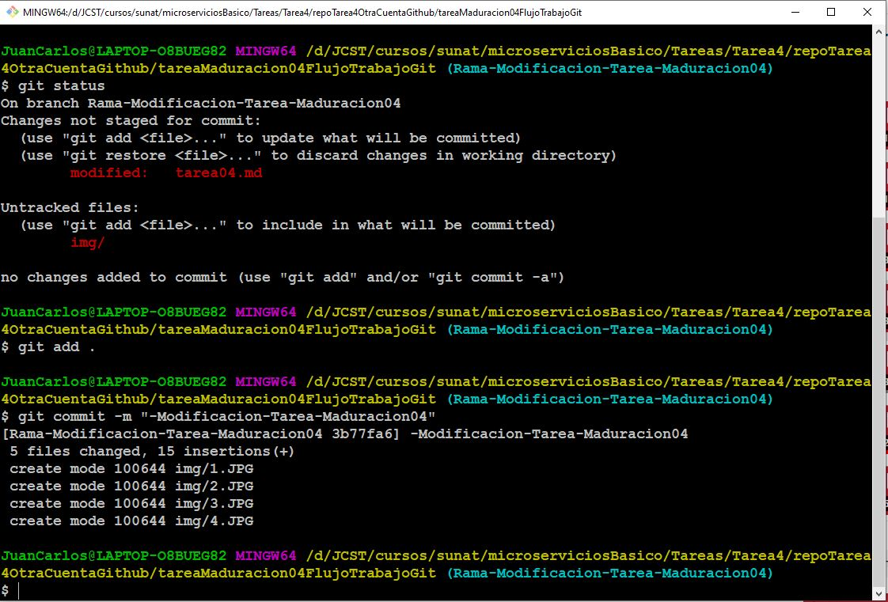

a. Confirmando los cambios.

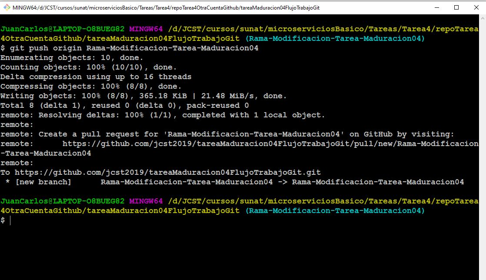
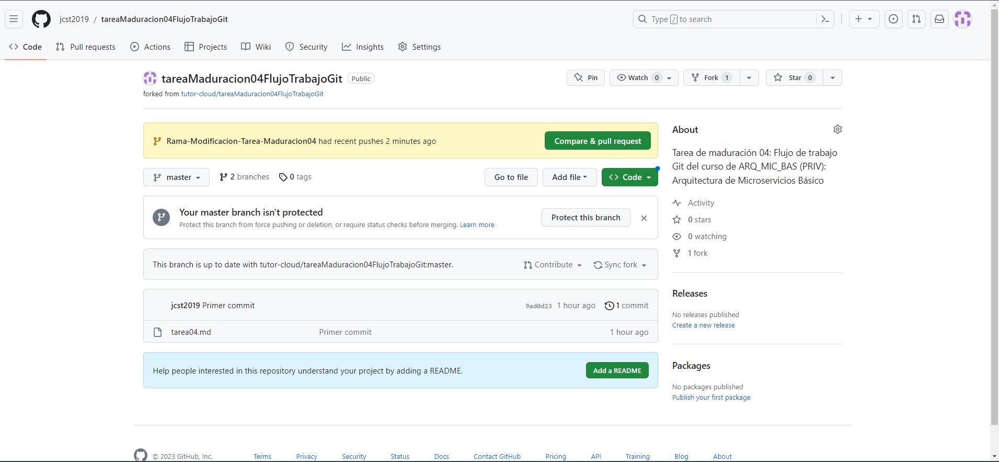
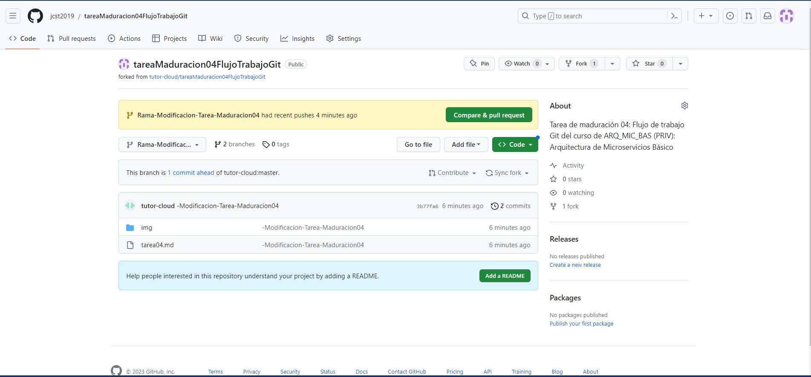
3. Solicitar una PR para la integración de cambios en el repositorio bifurcado (el original).
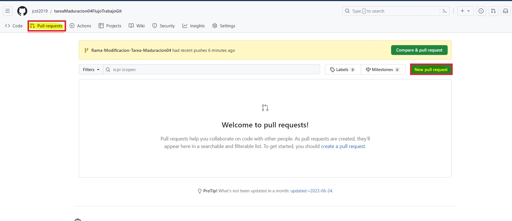
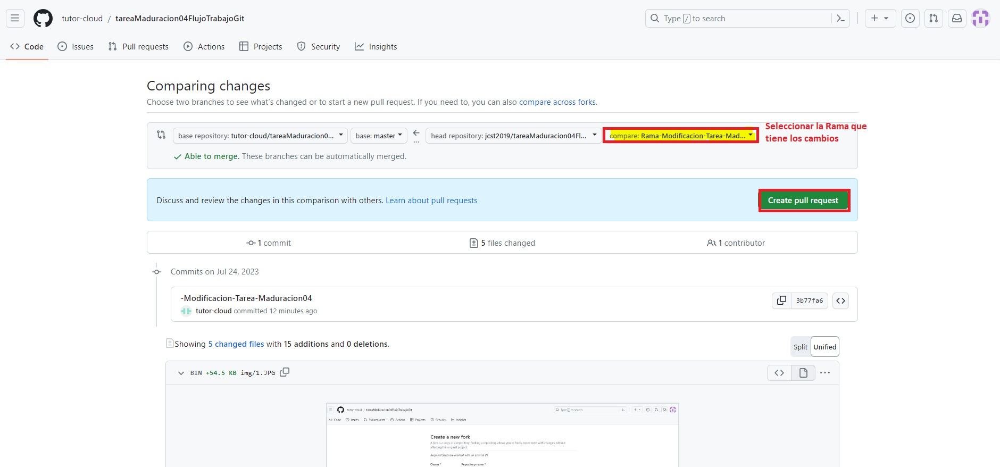
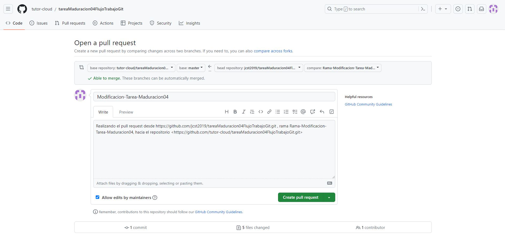
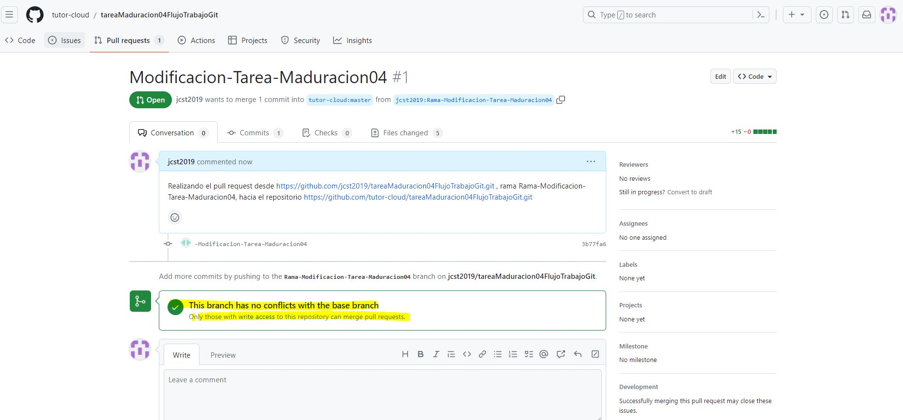
## Entregable                                             
[Indice](#indice)                                                                

### Ejecutar el flujo de trabajo forking en repositorios Git.

Dos instantáneas (capturas de pantalla formato .jpg o .png):
- **Una de la “Pull Request” en la que se aprecien los repositorios y ramas origen y destino.**

- **Una de la aceptación del “merge”.**
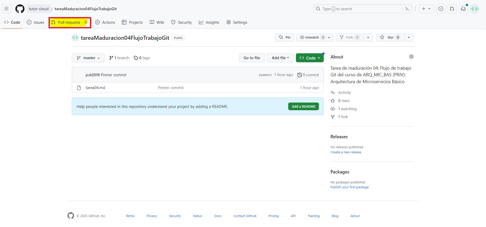
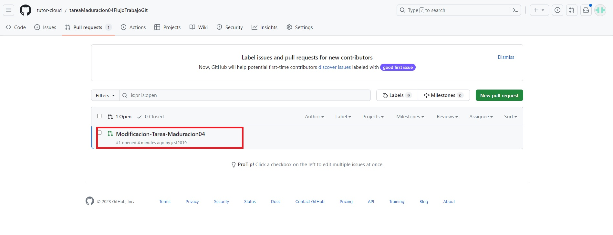
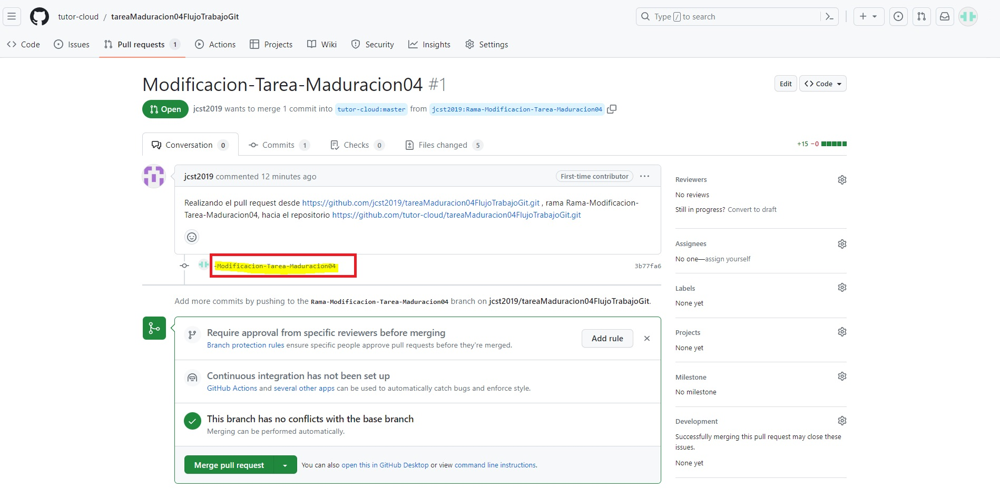
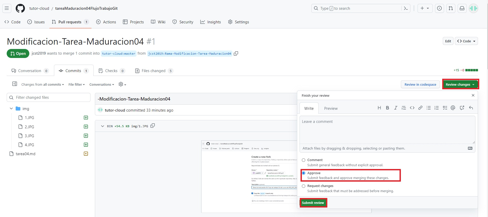
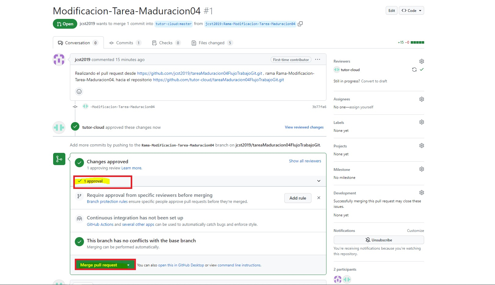
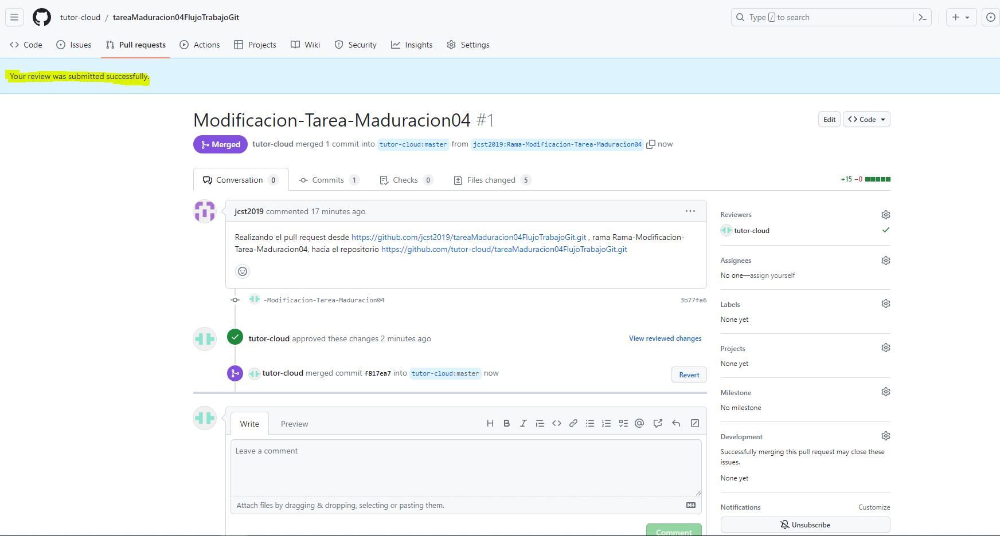
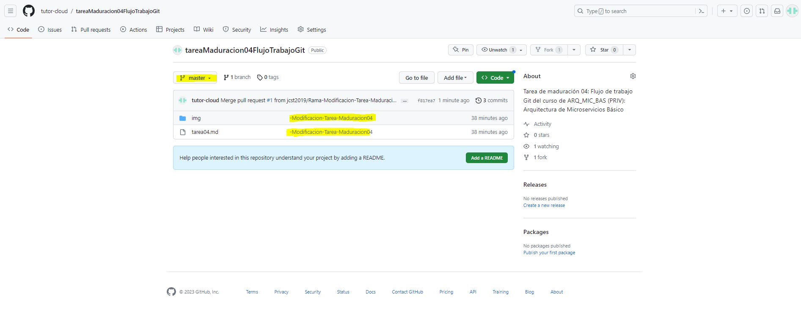

## Datos Alumno                                             
[Indice](#indice)                                                                
### Este bloque es parte de los cambios en el repositorio base.
# Datos del Programador

| Nombre      | Correo | Repositorio Base | Repositorio donde se solicita PR |
|-------------|------|---------------------------|-------------|
| Juan Carlos Solar Torres  | jsolart@sunat.gob.pe   | <https://github.com/tutor-cloud/tareaMaduracion04FlujoTrabajoGit.git>| <https://github.com/jcst2019/tareaMaduracion04FlujoTrabajoGit.git>      |

